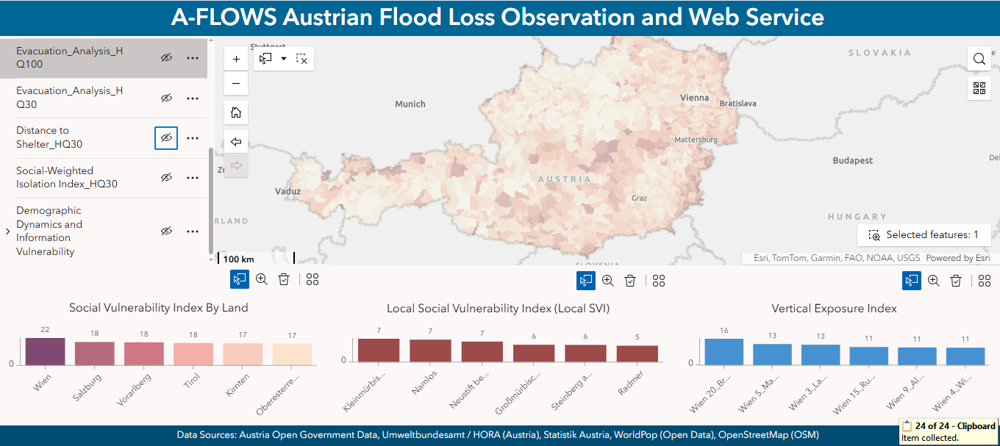
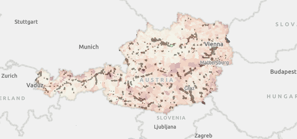
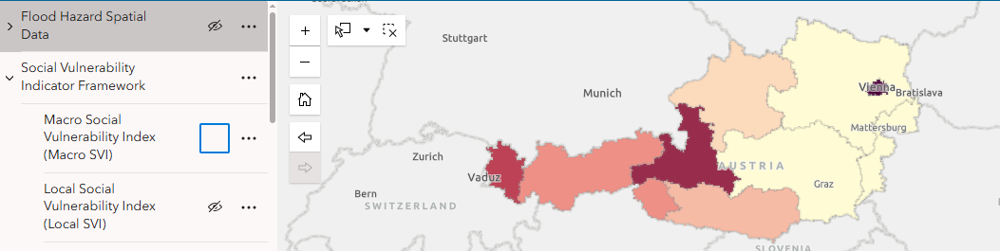
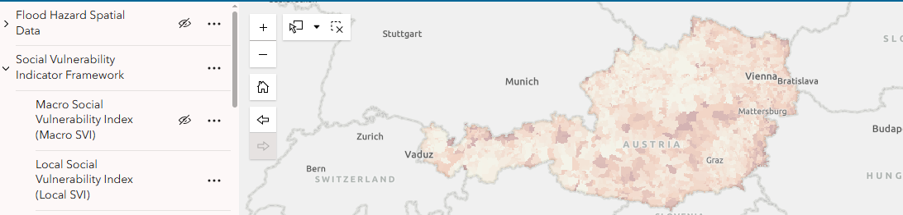
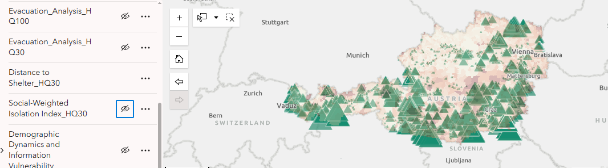

# A-FLOWS — Austrian Flood Risk SDI

**A Spatial Data Infrastructure for Flood Exposure, Social Vulnerability, and Shelter Accessibility Analysis in Austria**

A-FLOWS is an academic geospatial project developed to explore how flood-hazard information, demographic vulnerability, and emergency-shelter accessibility can be integrated within a standards-based Spatial Data Infrastructure (SDI).

The project combines Austrian flood-hazard datasets with demographic and administrative data to identify potentially exposed populations, characterize social vulnerability, and examine accessibility to emergency shelters during flood events.

---

## Project Overview

Flood risk is not determined by hazard extent alone. The consequences of flooding also depend on **who is exposed, how vulnerable affected populations are, and whether people can access safe locations**.

A-FLOWS therefore integrates three analytical perspectives:

- **Flood Exposure** — estimating populations potentially affected by HQ30 and HQ100 flood scenarios.
- **Social Vulnerability** — identifying demographic characteristics that may increase vulnerability during flood events.
- **Shelter Accessibility** — examining access to emergency shelters and identifying potentially isolated communities.

The resulting datasets and indicators are integrated into an SDI and communicated through an interactive web dashboard.

---

## Objectives

The project aimed to:

- integrate heterogeneous Austrian geospatial and demographic datasets;
- harmonize administrative identifiers and spatial reference systems;
- establish a PostgreSQL/PostGIS spatial database;
- calculate demographic and social-vulnerability indicators;
- estimate population exposure within flood-hazard zones;
- assess accessibility to emergency shelters;
- publish spatial information through OGC-compliant web services;
- document datasets using standardized metadata; and
- communicate results through an interactive web dashboard.

---

## System Architecture

The project follows a structured geospatial workflow:

**Data Acquisition → Preprocessing & Harmonization → PostgreSQL/PostGIS → Spatial Analysis → GeoServer → OGC Web Services → Interactive Dashboard**

### Data Sources

The analysis integrates several Austrian datasets, including:

- **Statistik Austria** demographic and administrative data;
- **eHYD / Austrian flood-hazard information** for HQ30 and HQ100 scenarios;
- administrative boundaries at municipality and *Zählsprengel* level;
- building footprints and land-use information;
- emergency-shelter locations; and
- supporting transport and accessibility information.

All spatial datasets were harmonized using the Austrian projected coordinate reference system **EPSG:31287 (MGI / Austria Lambert)**.

---

## Methodology

### 1. Data Preparation

Demographic and spatial datasets were cleaned, harmonized, and linked using administrative identifiers.

The processed data were stored in **PostgreSQL/PostGIS**, providing a centralized environment for spatial analysis and subsequent publication through GeoServer.

### 2. Social Vulnerability Analysis

Social Vulnerability Indices (SVI) were developed using demographic indicators associated with potentially vulnerable population groups.

The analysis considered factors including:

- age-related vulnerability;
- unemployment;
- migration background;
- household characteristics; and
- population structure.

Both broader and locally normalized vulnerability indicators were explored to reveal spatial differences across Austrian administrative units.

### 3. Flood Exposure Analysis

HQ30 and HQ100 flood-hazard zones were spatially integrated with demographic data.

An area-proportional approach was used to estimate the share of population potentially located within flood-affected areas.

This provided indicators describing:

- potentially exposed population;
- relative exposure at local level; and
- differences between flood scenarios.

### 4. Shelter Accessibility

Accessibility analysis examined the relationship between populated areas and emergency shelters.

Indicators were developed to investigate:

- distance to the nearest shelter;
- potentially isolated settlements;
- population-weighted accessibility; and
- the interaction between accessibility and social vulnerability.

---

## Spatial Data Infrastructure

A central component of A-FLOWS was the development of a standards-oriented SDI.

### Database

**PostgreSQL + PostGIS** were used for:

- structured spatial-data storage;
- attribute management;
- spatial queries;
- data integration; and
- analytical processing.

### GeoServer

Processed spatial datasets were published through **GeoServer** using Open Geospatial Consortium (OGC) standards.

Services included:

- **WMS — Web Map Service**
- **WFS — Web Feature Service**

### Metadata

Metadata documentation followed **ISO 19115** principles to improve dataset discoverability, documentation, and interoperability.

---

## Key Results

The project produced a series of spatial indicators and visualizations describing flood risk from multiple perspectives.

Key outputs included:

- demographic change patterns;
- Macro and Local Social Vulnerability Indices;
- household-level vulnerability indicators;
- estimated population exposure to flood-hazard zones;
- vertical exposure indicators;
- distance-to-shelter analysis;
- socially weighted isolation indicators; and
- an integrated interactive dashboard.

These results demonstrate how hazard, exposure, vulnerability, and accessibility information can be combined within a common geospatial framework for exploratory flood-risk assessment.

---

## Interactive Dashboard

The final stage of the project integrated selected results into an **ArcGIS Experience Builder** dashboard.

The dashboard was designed to support interactive exploration of:

- flood-hazard scenarios;
- demographic vulnerability;
- population exposure;
- shelter accessibility; and
- spatial patterns across Austrian administrative areas.

> **Dashboard access:** Public project link is being updated.

*Interactive A-FLOWS dashboard integrating flood hazard, social vulnerability, exposure, and accessibility indicators across Austria.*

---

## Selected Visual Results

### Flood Exposure — HQ100

*Spatial representation of flood exposure under the HQ100 (100-year return period) hazard scenario.*

### Social Vulnerability

#### Macro Social Vulnerability

*Austria-wide representation of social vulnerability patterns derived from demographic indicators.*

#### Local Social Vulnerability

*Local-scale Social Vulnerability Index highlighting spatial variations that may be obscured at broader aggregation levels.*

### Shelter Accessibility

*Spatial assessment of accessibility to emergency shelters, supporting the identification of areas facing potential evacuation and accessibility challenges.*

### Social Vulnerability
<!-- Social vulnerability map will be added here -->

### Flood Exposure
<!-- Flood exposure map will be added here -->

### Shelter Accessibility
<!-- Accessibility analysis map will be added here -->

---

## Technology Stack

| Component | Technologies |
|---|---|
| Spatial Database | PostgreSQL, PostGIS |
| GIS & Spatial Analysis | ArcGIS Pro, QGIS |
| SDI / Web Services | GeoServer, WMS, WFS |
| Web Visualization | ArcGIS Experience Builder |
| Metadata | ISO 19115 |
| Spatial Reference | EPSG:31287 — MGI / Austria Lambert |
| Data Processing | SQL, GIS-based geoprocessing |

---

## Project Team

A-FLOWS was developed collaboratively by:

- **Md Saleh Shakeel Nomaan**
- **Denis Vasin**
- **Qinwei Zhu**

This repository presents the project as part of my academic geospatial portfolio while acknowledging the collaborative nature of the original work.

---

## Academic Context

**Course:** IP:SDI  
**Programme:** MSc Applied Geoinformatics  
**Institution:** University of Salzburg, Austria  
**Semester:** Winter Term 2025/26

The original project materials were developed collaboratively within the university GitLab environment. This GitHub repository is a curated portfolio version focusing on the project's methodology, geospatial workflow, analytical outputs, and SDI implementation.

---

## Documentation

For a detailed description of the project methodology, SDI architecture, spatial analyses, results, and discussion, see the full academic project report:

**[View A-FLOWS Final Project Report](docs/A-FLOWS_Final_Report.pdf)**

The report was prepared collaboratively by **Md Saleh Shakeel Nomaan, Denis Vasin, and Qinwei Zhu** as part of the MSc Applied Geoinformatics programme at the University of Salzburg.

## Repository Status

This repository is maintained as a **portfolio and academic project showcase**. The original university GitLab repository contains the collaborative development history and working materials.
